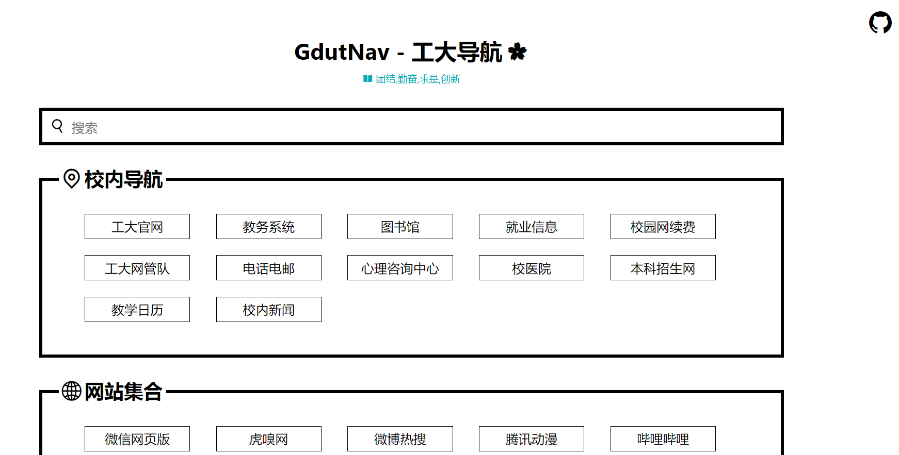

# gdutnav
> 工大导航, 提供校内站点的快捷访问, 并收集了许多有用有趣的东西
## 使用方式
直接访问地址 [Online](https://brenner8023.github.io)


## 关于项目
- 使用了create-react-app/react/iconfont
- 使用了es6/css3/html5/scss
## 开发
```npm
npm install

npm run start # 运行项目预览

npm run build # 编译
```
